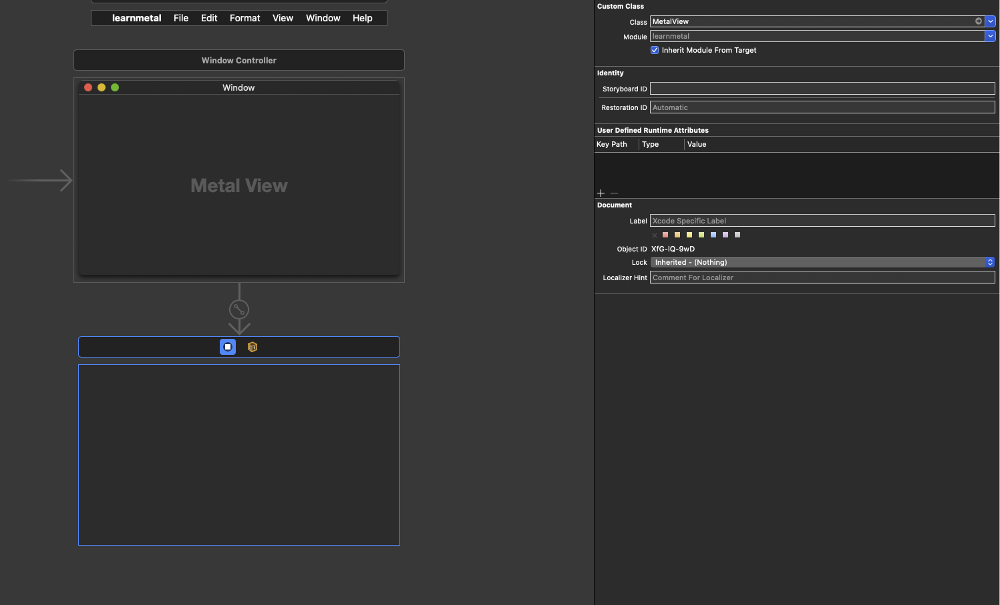
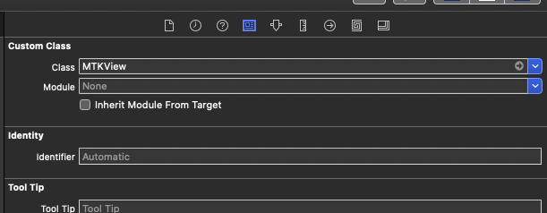

```
 _____ ______   _______  _________  ________  ___          
|\   _ \  _   \|\  ___ \|\___   ___\\   __  \|\  \         
\ \  \\\__\ \  \ \   __/\|___ \  \_\ \  \|\  \ \  \        
 \ \  \\|__| \  \ \  \_|/__  \ \  \ \ \   __  \ \  \       
  \ \  \    \ \  \ \  \_|\ \  \ \  \ \ \  \ \  \ \  \____  
   \ \__\    \ \__\ \_______\  \ \__\ \ \__\ \__\ \_______\
    \|__|     \|__|\|_______|   \|__|  \|__|\|__|\|_______|
```                                                           
                                                           
                                                           

<!-- vscode-markdown-toc -->
* [Links](#Links)
* [Metal Things](#MetalThings)
* [MTLDevice Protocol](#MTLDeviceProtocol)
	* [Command Queues](#CommandQueues)
	* [Command Buffers](#CommandBuffers)
	* [Commands](#Commands)
* [Render Pipeline](#RenderPipeline)
	* [MTLRenderPipelineState protocol](#MTLRenderPipelineStateprotocol)
	* [MTLRenderPipelineDescriptor](#MTLRenderPipelineDescriptor)
	* [Encoding commands to the Command Buffer](#EncodingcommandstotheCommandBuffer)
* [Shaders (Graphics Functions)](#ShadersGraphicsFunctions)
	* [MSL Metal Shader Language](#MSLMetalShaderLanguage)
	* [Culling](#Culling)
	* [Primitives](#Primitives)
	* [Rasterization](#Rasterization)
	* [Fragment Shading](#FragmentShading)
	* [Raster Output](#RasterOutput)
* [Getting Started](#GettingStarted)
	* [Setting up device](#Settingupdevice)
	* [Storyboard](#Storyboard)
	* [MTLPixelFormat](#MTLPixelFormat)
	* [Metal + MTKView setup in storyboard](#MetalMTKViewsetupinstoryboard)
	* [Summary](#Summary)
	* [MDLMesh](#MDLMesh)
	* [MakeRenderPipelineState](#MakeRenderPipelineState)
	* [Renderer and MTKViewDelegate](#RendererandMTKViewDelegate)
* [Command Buffers](#CommandBuffers-1)
* [CommandEncoders](#CommandEncoders)
* [Render Pipeline State](#RenderPipelineState)
* [Getting the MTL Library Vertex Shader / Fragment](#GettingtheMTLLibraryVertexShaderFragment)
* [MTLBuffer](#MTLBuffer)
* [Screen Space Coordinates](#ScreenSpaceCoordinates)
* [Device Space](#DeviceSpace)
* [Rasterizer](#Rasterizer)

<!-- vscode-markdown-toc-config
	numbering=false
	autoSave=true
	/vscode-markdown-toc-config -->
<!-- /vscode-markdown-toc -->

## <a name='Links'></a>Links
- [Raywenderlich Metal Tutorial](https://www.raywenderlich.com/7475-metal-tutorial-getting-started)
- [Metal Basics: Performing GPU Calc](https://developer.apple.com/documentation/metal/basic_tasks_and_concepts/performing_calculations_on_a_gpu)

-----------------------------------------------------------

## <a name='MetalThings'></a>Metal Things
- MetalKit
- MTLDevice protocol

-----------------------------------------------------------

## <a name='MTLDeviceProtocol'></a>MTLDevice Protocol 

- Creates and manages persistent and transient objects 
- MTLDevice allows you to create `command queues` 

### <a name='CommandQueues'></a>Command Queues

- These queues hold `command buffers` where the buffers contain: `encoders` that attach commands for the GPUs


### <a name='CommandBuffers'></a>Command Buffers

- Hold every instruction necesssary to render a frame
- Instructions include command to `set state` which controls how drawing is done
- Once the buffer work is done it is `deallocated`

### <a name='Commands'></a>Commands

- Commands are encoded in the command buffer
- Commands are executed in the order they are queued
- Once all commands are enqueued the command buffer is `committed and submitted to the command queue`

-----------------------------------------------------------

## <a name='RenderPipeline'></a>Render Pipeline


- Metal tries to move CPU intensive work to the beginning
- For examlpe process of `state validation`

### <a name='MTLRenderPipelineStateprotocol'></a>MTLRenderPipelineState protocol 
- States can be set quickly on a render command encoder
- Render pipeline state contains a collection of states

### <a name='MTLRenderPipelineDescriptor'></a>MTLRenderPipelineDescriptor 
- Contains properties which configure how pipeline state object is created
- This offloads the validation of state on every draw call to this 
- Prevalidated states with the following settings:

• Specifying shader functions
• Attaching color, depth, and stencil data
• Raster and visibility state
• Tessellation state

- Validation of States is an expensive step so with the above being prevalidated it can avoid it 
- The `MTLPRenderPipelineState can be passed to the command encoder` since its valid 

### <a name='EncodingcommandstotheCommandBuffer'></a>Encoding commands to the Command Buffer

• MTLRenderCommandEncoder
• MTLComputeCommandEncoder
• MTLBlitCommandEncoder
• MTLParallelRenderCommandEncoder

For graphics you will use the MTLRenderCommandEncoder. The render encoder will need to prepare vertex and fragment buffers.

-----------------------------------------------------------

## <a name='ShadersGraphicsFunctions'></a>Shaders (Graphics Functions)
- Vertex / Fragment
- Function Argument list enumerates the resources they operate on
- Arguments are bound to buffer and texture objects through the `argument table`
- Arguments are passed into the shader
- The vertex shader gets called for every single vertex you have referenced in a draw call

### <a name='MSLMetalShaderLanguage'></a>MSL Metal Shader Language
- Based on a subset of C++ 14 
- Has int, floats, dot methods for matrices


### <a name='Culling'></a>Culling
- Camera vs World -- Things outside the view of the camera is culled 
- Data that isn't culled is passed to the rasterizer (Vertex shader determines culling)

### <a name='Primitives'></a>Primitives
- Points - One vertex
- Lines - Two vertices
- Triangles - Three vertices

### <a name='Rasterization'></a>Rasterization
- How images appear on screen is rasterization
- Not just what shapes and primitives but also how light is scattered around the scene
- This is different to `ray tracing` which solves this problem in the opposite way 
- Rasterization projects primitives to the screen then loops over the pixels to whether an object is present in the pixel
- It then fills it with a color 

### <a name='FragmentShading'></a>Fragment Shading
- Calculate color, rgb and alpha 
- If lighting is involved it will determine the color based on that
- If you are doing `texture mapping` fragment shader will manage this as well
- Last stop before sending data to the frame buffer to output

### <a name='RasterOutput'></a>Raster Output
- Instead of rawing to screen the image is composed and `stored in the frame buffer` 
- There are two frame buffers at one time to prevent flickering
- `Front Frame Buffer` and `Back Frame Buffer`
- These are swapped 

-----------------------------------------------------------

## <a name='GettingStarted'></a>Getting Started

- Appcode / Xcode / Simulator etc 
- [SwiftLint](https://github.com/realm/SwiftLint) & AppCode Plugin

### <a name='Settingupdevice'></a>Setting up device
- In this guide [clientresourcesinc](https://www.clientresourcesinc.com/2018/04/30/rendering-graphics-with-metalkit-swift-4-part-1/)
	- They use a seperate view MetalView.swift
	- Also they change the storyboard's Viewcontroller to use MetalView.swift rather than ViewController.swift

### <a name='Storyboard'></a>Storyboard
- See here how you can configure different views 



### <a name='MTLPixelFormat'></a>MTLPixelFormat
- Enum containing different values such as : `bgra8Unorm`

### <a name='MetalMTKViewsetupinstoryboard'></a>Metal + MTKView setup in storyboard
- In the storyboard you can setup MTVKView



```swift
class ViewController: NSViewController {

    var renderer: Renderer?

    override func viewDidLoad() {
        super.viewDidLoad()
        // Do any additional setup after loading the view.
        guard let metalView = view as? MTKView else {
            fatalError("Metal view not setup")
        }
    }
```

### <a name='Summary'></a>Summary
1. Setup Storyboard to use a MTKView
2. ViewController is simple:

```swift
import MetalKit


class ViewController: NSViewController {

    var renderer: Renderer?

    override func viewDidLoad() {
        super.viewDidLoad()
        // Do any additional setup after loading the view.
        guard let metalView = view as? MTKView else {
            fatalError("Metal view not setup")
        }
        renderer = Renderer(metalView: metalView)
    }


    override var representedObject: Any? {
      didSet {
        // Update the view, if already loaded.
      }
    }
}
```

Will create a metalView and pass that to a "Renderer"

3. Renderer.swift

```swift
import MetalKit


import MetalKit

class Renderer: NSObject {

    static var device: MTLDevice!
    static var commandQueue: MTLCommandQueue!
    var mesh: MTKMesh!
    var vertexBuffer: MTLBuffer!
    var pipelineState: MTLRenderPipelineState!

    var timer: Float = 0

    init(metalView: MTKView) {
        guard let device = MTLCreateSystemDefaultDevice() else {
            fatalError("GPU not available")
        }
        metalView.device = device
        Renderer.device = device
        Renderer.commandQueue = device.makeCommandQueue()!
		...(continued)
```

Setup the render with the following fields:

- An MTLDevice
- An MTLCommandQueue
- MTKMesh
- MTKBuffer 
- MTLRenderPipelineState

We also have created a special metal file `Shaders.metal` with the following

```c++
#include <metal_stdlib>
using namespace metal;

struct VertexIn {
  float4 position [[ attribute(0) ]];
};

vertex float4 vertex_main(const VertexIn vertexIn [[ stage_in ]],
                          constant float &timer [[ buffer(1) ]]) {
  float4 position = vertexIn.position;
  position.y += timer;
  return position;
}

fragment float4 fragment_main() {
  return float4(1, 0, 0, 1);
}
```

-----------------------------------------------------------

### <a name='MDLMesh'></a>MDLMesh
- [Official Docs](https://developer.apple.com/documentation/modelio/mdlmesh)
- Make primitives like sphere cube triangle etc

-----------------------------------------------------------


### <a name='MakeRenderPipelineState'></a>MakeRenderPipelineState

```swift
        let pipelineDescriptor = MTLRenderPipelineDescriptor()
        pipelineDescriptor.vertexFunction = vertexFunction
        pipelineDescriptor.fragmentFunction = fragmentFunction
        pipelineDescriptor.vertexDescriptor = MTKMetalVertexDescriptorFromModelIO(mdlMesh.vertexDescriptor)
        pipelineDescriptor.colorAttachments[0].pixelFormat = metalView.colorPixelFormat

        // After doing setup stuff let's make render pipeline staate
        do {
            pipelineState = try device.makeRenderPipelineState(descriptor: pipelineDescriptor)
        } catch let error {
            fatalError(error.localizedDescription)
        }
```

-----------------------------------------------------------

### <a name='RendererandMTKViewDelegate'></a>Renderer and MTKViewDelegate 
- Needs to implement this? 
- Two methods:

1. func mtkView
2. func draw


-----------------------------------------------------------

## <a name='CommandBuffers-1'></a>Command Buffers
- Needs a CommandEncoder

## <a name='CommandEncoders'></a>CommandEncoders
- Render Command Encoder -- needs a renderPassDescriptor
- Compute COmmand Encoder -- needs..? 

## <a name='RenderPipelineState'></a>Render Pipeline State
- Render Pipeline Descriptor
    - Vertex Function, Fragment function, Color Attachment
    - Needs consistent Color Attachment Descriptor 

-----------------------------------------------------------

## <a name='GettingtheMTLLibraryVertexShaderFragment'></a>Getting the MTL Library Vertex Shader / Fragment

```swift
        let library = device.makeDefaultLibrary()
        let vertexFunction = library?.makeFunction(name: "vertex_main")
        let fragmentFunction = library?.makeFunction(name: "fragment_main")
```

-----------------------------------------------------------

## <a name='MTLBuffer'></a>MTLBuffer

- Unformatted Device Accessible Space
- MTLBuffer is given a fixed amount of bytes 
- CPU <- Read & Write -> Write

-----------------------------------------------------------

## <a name='ScreenSpaceCoordinates'></a>Screen Space Coordinates
- (0,0,0) - is in the middle of the screen 
- (0,1,0) - top of screen


-----------------------------------------------------------

## <a name='DeviceSpace'></a>Device Space
- 30 alllowed buffer memory 

-----------------------------------------------------------

## <a name='Rasterizer'></a>Rasterizer
- Vertex -> Rasterizer -> Fragment


-----------------------------------------------------------

## VertexDescriptor
- Passing in per vertex information 

-----------------------------------------------------------

## MEsh stuff might be useful later

```swift
//
//        let mdlMesh = Primitive.cube(device: device, size: 1.0)
//        let mdlMesh = Primitive.sphere(device: device, size: 1.0)
//        mesh = try! MTKMesh(mesh: mdlMesh, device: device)
//        vertexBuffer = mesh.vertexBuffers[0].buffer

and in draw

//        for submesh in mesh.submeshes {
//            renderEncoder.drawIndexedPrimitives(type: .triangle,
//                    indexCount: submesh.indexCount,
//                    indexType: submesh.indexType,
//                    indexBuffer: submesh.indexBuffer.buffer,
//                    indexBufferOffset: submesh.indexBuffer.offset)
//        }
```