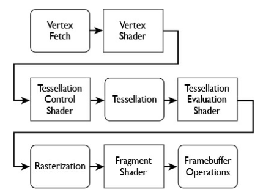

```
 _____ ______   _______  _________  ________  ___          
|\   _ \  _   \|\  ___ \|\___   ___\\   __  \|\  \         
\ \  \\\__\ \  \ \   __/\|___ \  \_\ \  \|\  \ \  \        
 \ \  \\|__| \  \ \  \_|/__  \ \  \ \ \   __  \ \  \       
  \ \  \    \ \  \ \  \_|\ \  \ \  \ \ \  \ \  \ \  \____  
   \ \__\    \ \__\ \_______\  \ \__\ \ \__\ \__\ \_______\
    \|__|     \|__|\|_______|   \|__|  \|__|\|__|\|_______|
```                                                           
                                                           
                                                           

<!-- vscode-markdown-toc -->
* [Links](#Links)
* [Metal Things](#MetalThings)
* [MTLDevice Protocol](#MTLDeviceProtocol)
	* [Command Queues](#CommandQueues)
	* [Command Buffers](#CommandBuffers)
	* [Commands](#Commands)
* [Render Pipeline](#RenderPipeline)
	* [MTLRenderPipelineState protocol](#MTLRenderPipelineStateprotocol)
	* [MTLRenderPipelineDescriptor](#MTLRenderPipelineDescriptor)
	* [Encoding commands to the Command Buffer](#EncodingcommandstotheCommandBuffer)
* [Shaders (Graphics Functions)](#ShadersGraphicsFunctions)
	* [MSL Metal Shader Language](#MSLMetalShaderLanguage)
	* [Culling](#Culling)
	* [Primitives](#Primitives)
	* [Rasterization](#Rasterization)
	* [Fragment Shading](#FragmentShading)
	* [Raster Output](#RasterOutput)

<!-- vscode-markdown-toc-config
	numbering=false
	autoSave=true
	/vscode-markdown-toc-config -->
<!-- /vscode-markdown-toc -->

## <a name='Links'></a>Links
- [Raywenderlich Metal Tutorial](https://www.raywenderlich.com/7475-metal-tutorial-getting-started)
- [Metal Basics: Performing GPU Calc](https://developer.apple.com/documentation/metal/basic_tasks_and_concepts/performing_calculations_on_a_gpu)

-----------------------------------------------------------

## <a name='MetalThings'></a>Metal Things
- MetalKit
- MTLDevice protocol

-----------------------------------------------------------

## <a name='MTLDeviceProtocol'></a>MTLDevice Protocol 

- Creates and manages persistent and transient objects 
- MTLDevice allows you to create `command queues` 

### <a name='CommandQueues'></a>Command Queues

- These queues hold `command buffers` where the buffers contain: `encoders` that attach commands for the GPUs


### <a name='CommandBuffers'></a>Command Buffers

- Hold every instruction necesssary to render a frame
- Instructions include command to `set state` which controls how drawing is done
- Once the buffer work is done it is `deallocated`

### <a name='Commands'></a>Commands

- Commands are encoded in the command buffer
- Commands are executed in the order they are queued
- Once all commands are enqueued the command buffer is `committed and submitted to the command queue`

-----------------------------------------------------------

## <a name='RenderPipeline'></a>Render Pipeline



- Metal tries to move CPU intensive work to the beginning
- For examlpe process of `state validation`

### <a name='MTLRenderPipelineStateprotocol'></a>MTLRenderPipelineState protocol 
- States can be set quickly on a render command encoder
- Render pipeline state contains a collection of states

### <a name='MTLRenderPipelineDescriptor'></a>MTLRenderPipelineDescriptor 
- Contains properties which configure how pipeline state object is created
- This offloads the validation of state on every draw call to this 
- Prevalidated states with the following settings:

• Specifying shader functions
• Attaching color, depth, and stencil data
• Raster and visibility state
• Tessellation state

- Validation of States is an expensive step so with the above being prevalidated it can avoid it 
- The `MTLPRenderPipelineState can be passed to the command encoder` since its valid 

### <a name='EncodingcommandstotheCommandBuffer'></a>Encoding commands to the Command Buffer

• MTLRenderCommandEncoder
• MTLComputeCommandEncoder
• MTLBlitCommandEncoder
• MTLParallelRenderCommandEncoder

For graphics you will use the MTLRenderCommandEncoder. The render encoder will need to prepare vertex and fragment buffers.

-----------------------------------------------------------

## <a name='ShadersGraphicsFunctions'></a>Shaders (Graphics Functions)
- Vertex / Fragment
- Function Argument list enumerates the resources they operate on
- Arguments are bound to buffer and texture objects through the `argument table`
- Arguments are passed into the shader
- The vertex shader gets called for every single vertex you have referenced in a draw call

### <a name='MSLMetalShaderLanguage'></a>MSL Metal Shader Language
- Based on a subset of C++ 14 
- Has int, floats, dot methods for matrices


### <a name='Culling'></a>Culling
- Camera vs World -- Things outside the view of the camera is culled 
- Data that isn't culled is passed to the rasterizer (Vertex shader determines culling)

### <a name='Primitives'></a>Primitives
- Points - One vertex
- Lines - Two vertices
- Triangles - Three vertices

### <a name='Rasterization'></a>Rasterization
- How images appear on screen is rasterization
- Not just what shapes and primitives but also how light is scattered around the scene
- This is different to `ray tracing` which solves this problem in the opposite way 
- Rasterization projects primitives to the screen then loops over the pixels to whether an object is present in the pixel
- It then fills it with a color 

### <a name='FragmentShading'></a>Fragment Shading
- Calculate color, rgb and alpha 
- If lighting is involved it will determine the color based on that
- If you are doing `texture mapping` fragment shader will manage this as well
- Last stop before sending data to the frame buffer to output

### <a name='RasterOutput'></a>Raster Output
- Instead of rawing to screen the image is composed and `stored in the frame buffer` 
- There are two frame buffers at one time to prevent flickering
- `Front Frame Buffer` and `Back Frame Buffer`
- These are swapped 

-----------------------------------------------------------
i